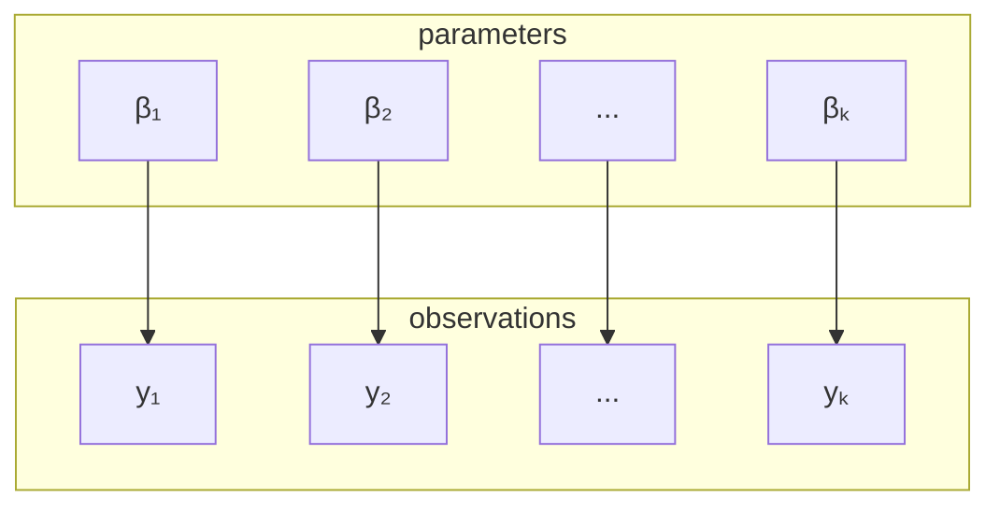
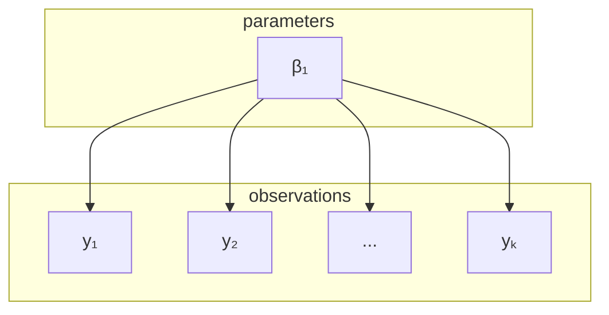
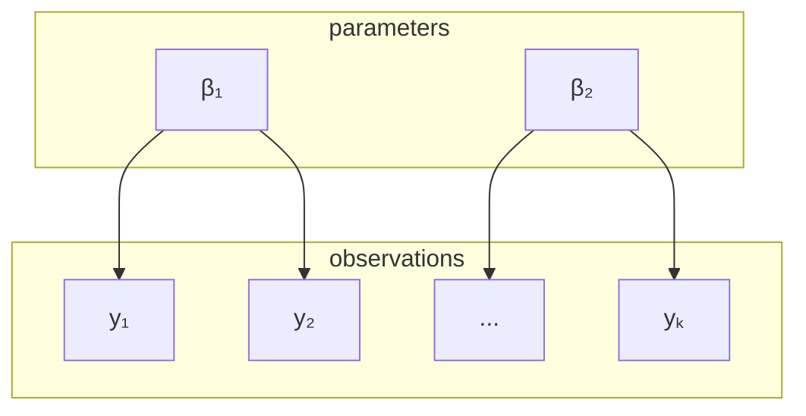

# Non-Hierarchical Model (no pooling)

```mermaid
graph TD    
    subgraph "parameters"
        B1[β₁]
        B2[β₂]
        B3[...]
        Bk[βₖ]
    end
    
    subgraph "observations"
        Y1[y₁]
        Y2[y₂]
        Y3[...]
        Yk[yₖ]
    end
    
    B1 --> Y1
    B2 --> Y2
    B3 --> Y3
    Bk --> Yk
```

# Non-Hierarchical Model (complete pooling)

```mermaid
graph TD    
    subgraph "parameters"
        B1[β₁]
    end
    
    subgraph "observations"
        Y1[y₁]
        Y2[y₂]
        Y3[...]
        Yk[yₖ]
    end
    
    B1 --> Y1
    B1 --> Y2
    B1 --> Y3
    B1 --> Yk
```

# Hierarchical Model 

```mermaid
graph TD    
    subgraph "parameters"
        B1[β₁]
        B2[β₂]
    end
    
    subgraph "observations"
        Y1[y₁]
        Y2[y₂]
        Y3[...]
        Yk[yₖ]
    end
    
    B1 --> Y1
    B1 --> Y2
    B2 --> Y3
    B2 --> Yk
```